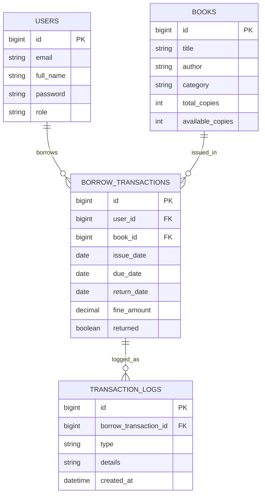

```mermaid
erDiagram
  USERS ||--o{ BORROW_TRANSACTIONS : borrows
  BOOKS ||--o{ BORROW_TRANSACTIONS : issued_in
  BORROW_TRANSACTIONS ||--o{ TRANSACTION_LOGS : logged_as

  USERS {
    bigint id PK
    string email
    string full_name
    string password
    string role
  }

  BOOKS {
    bigint id PK
    string title
    string author
    string category
    int total_copies
    int available_copies
  }

  BORROW_TRANSACTIONS {
    bigint id PK
    bigint user_id FK
    bigint book_id FK
    date issue_date
    date due_date
    date return_date
    decimal fine_amount
    boolean returned
  }

  TRANSACTION_LOGS {
    bigint id PK
    bigint borrow_transaction_id FK
    string type
    string details
    datetime created_at
  }
```
