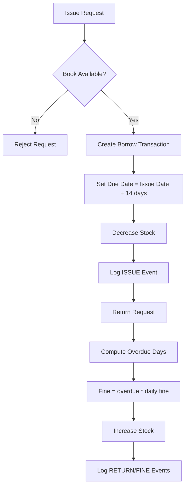

## Issue & Return Flow

```mermaid
flowchart TD
  A[Issue Request] --> B{Book Available?}
  B -- No --> C[Reject Request]
  B -- Yes --> D[Create Borrow Transaction]
  D --> E[Set Due Date = Issue Date + 14 days]
  E --> F[Decrease Stock]
  F --> G[Log ISSUE Event]
  G --> H[Return Request]
  H --> I[Compute Overdue Days]
  I --> J[Fine = overdue * daily fine]
  J --> K[Increase Stock]
  K --> L[Log RETURN/FINE Events]
```
